# Interpreter - Security Assessment Report

Penetration testing assessment of the Hack The Box **Interpreter** machine using a structured six-phase security assessment methodology.

---

# Overview

This report documents a security assessment of the Hack The Box machine **Interpreter**. The objective of the assessment was to identify and validate security weaknesses across the exposed services and application components, determine their potential impact, and demonstrate the resulting attack path.

The assessment identified multiple weaknesses throughout the target environment, beginning with reconnaissance of an exposed Mirth Connect deployment. Subsequent analysis led to application-level compromise, extraction of credential material, GPU-assisted password recovery, authenticated SSH access, local service enumeration, source code analysis, identification of an unsafe Python `eval()` implementation, and successful privilege escalation resulting in root-level code execution.

The complete attack chain progressed from external reconnaissance to full system compromise while following a structured six-phase security assessment methodology.

---

# Scope

| Item | Details |
|------|---------|
| **Target** | Interpreter |
| **Platform** | Hack The Box |
| **Operating System** | Debian Linux |
| **Assessment Type** | Black Box Security Assessment |
| **Primary Technologies** | Jetty, Mirth Connect, Java, Python, PostgreSQL |
| **Objective** | Identify and validate security weaknesses leading to full system compromise |
| **Out of Scope** | Denial of Service (DoS), brute-force attacks, attacks against external infrastructure |

---

# Methodology

The assessment followed a structured six-phase security assessment methodology designed to provide a repeatable and systematic approach for evaluating the security of web applications and supporting infrastructure.

The testing process consisted of the following phases:

1. Preparation and Scope Definition
2. Reconnaissance and Information Gathering
3. Vulnerability Discovery
4. Controlled Exploitation
5. Risk Assessment
6. Security Recommendations

Each finding was validated through controlled testing and supported by technical evidence collected during the assessment.

---

# Reconnaissance

Initial reconnaissance identified three publicly accessible services exposed by the target host.

| Port | Service | Version |
|------|---------|---------|
| 22 | SSH | OpenSSH 9.2p1 |
| 80 | HTTP | Jetty |
| 443 | HTTPS | Jetty |

The HTTP and HTTPS services hosted the **Mirth Connect Administrator** interface, immediately identifying the primary application under assessment.

The presence of both HTTP and HTTPS interfaces suggested a Java-based enterprise application. Initial enumeration therefore focused on technology identification, deployment artifacts, and available application resources.

### Nmap Scan

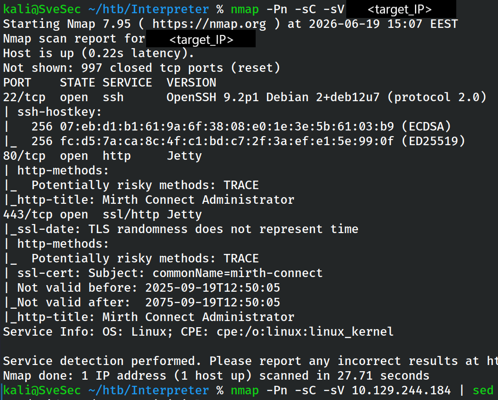

**Evidence File**

`evidence/files/01_nmap_initial_scan.txt`

---

# Attack Surface Analysis

Further enumeration confirmed that the exposed application was **Mirth Connect**, exposing both the administrative interface and deployment artifacts commonly associated with the platform.

Inspection of the available resources identified the Java Web Start launcher (`webstart.jnlp`), providing valuable information regarding the application deployment model.

These findings significantly reduced the attack surface by positively identifying the underlying technology stack and enabling targeted security research during the following assessment phases.

### Mirth Connect Administrator

**Evidence File**

`evidence/files/02_webstart_jnlp.txt`

---

# Vulnerability Discovery

Public vulnerability research identified **CVE-2023-43208**, a critical unauthenticated Remote Code Execution vulnerability affecting Mirth Connect versions prior to **4.4.1**.

The target was confirmed as **Mirth Connect 4.4.0**, which falls within the vulnerable range. The vulnerability research phase established that exploitation did not require authentication and represented a realistic path toward remote command execution.

### CVE Research

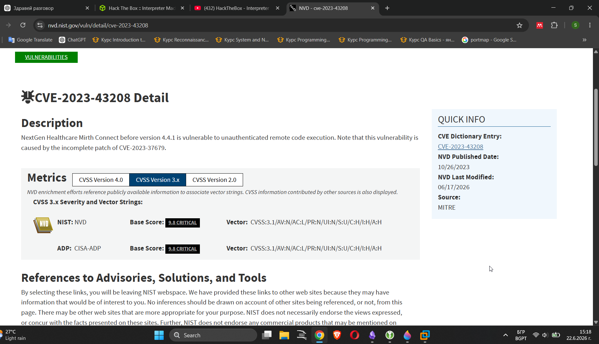

---

# Controlled Exploitation

After confirming that the target was running a vulnerable version of Mirth Connect, controlled exploitation was performed to validate the impact of **CVE-2023-43208**.

The exploitation process was performed incrementally. Instead of immediately attempting to obtain an interactive shell, a simple ICMP-based validation was used first. This confirmed that arbitrary command execution was possible while keeping the initial test low-impact and easy to verify.

### Remote Code Execution Validation

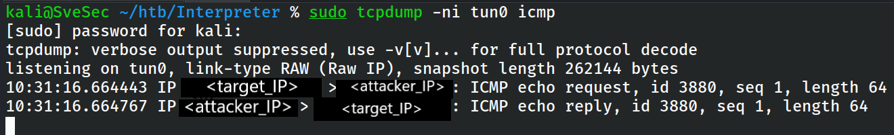

**Evidence File**

`evidence/files/03_rce_ping_validation.txt`

---

# Initial Access

After validating remote command execution, the payload was extended to obtain an interactive shell on the target system.

The shell confirmed that the vulnerability could be used to gain execution on the underlying operating system through the exposed Mirth Connect service.

### Initial Shell

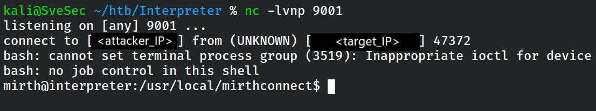

The initial shell provided the foothold required for local enumeration, credential discovery, and further privilege escalation analysis.

---

# Local Enumeration

Following initial access, local enumeration was performed to identify the execution context, available services, sensitive files, and potential privilege escalation vectors.

The compromised shell was running with limited privileges under the Mirth Connect service account. Initial enumeration focused on understanding the environment before attempting privilege escalation.

### User Context

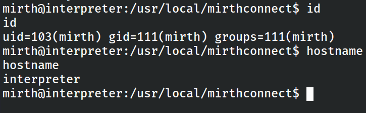

The enumeration confirmed the current user context and provided the starting point for further privilege escalation analysis.

---

## Mirth Installation Analysis

Enumeration of the application directories revealed the Mirth Connect installation structure and several configuration files containing sensitive information.

### Mirth Installation Directory

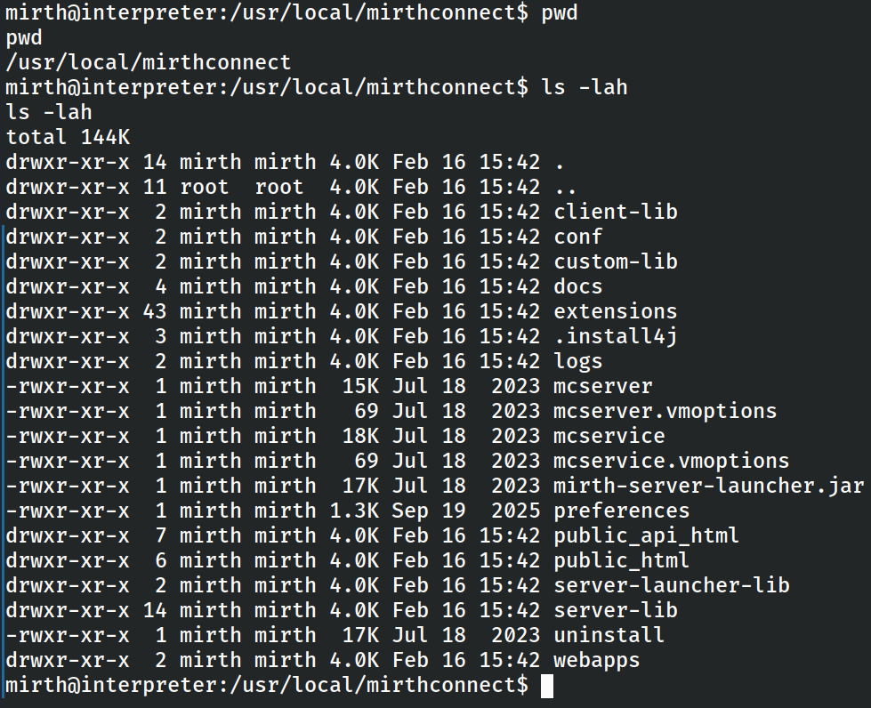

Reviewing the application configuration files exposed credentials used by the backend PostgreSQL database.

### Database Credentials

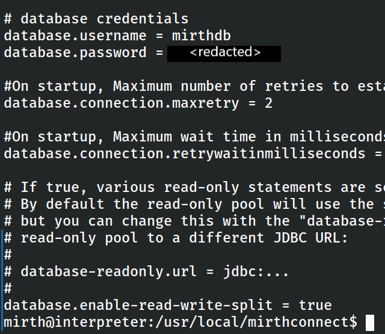

The recovered credentials enabled authenticated access to the database, allowing further enumeration of stored application data.

---

## Database Enumeration

Using the recovered configuration credentials, authenticated access to the PostgreSQL database was established.

Database enumeration identified application tables containing user account information and password hashes.

### Database Access

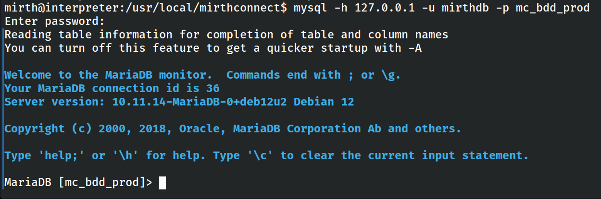

Further inspection revealed the stored credential records for privileged application users.

### Database User Credentials

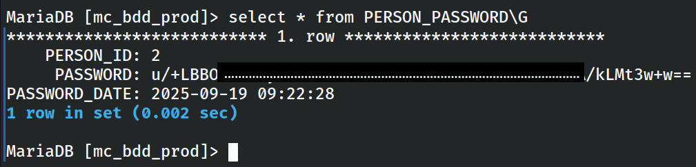

The extracted password hashes were preserved for offline password recovery.

---

# Credential Recovery

The password hashes recovered from the PostgreSQL database were analyzed to determine the underlying hashing algorithm.

The stored credentials were identified as **PBKDF2-SHA256** hashes, allowing offline password recovery using Hashcat.

Offline password cracking was selected instead of further interaction with the target system in order to minimize additional activity against the host while validating the strength of the stored credentials.

### Password Recovery

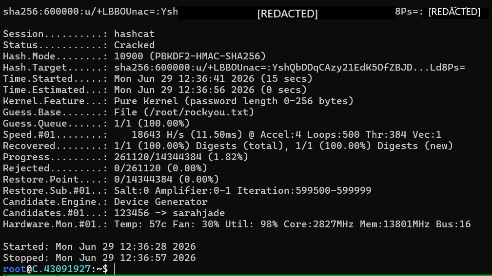

The recovered plaintext password successfully authenticated against the target system via SSH, providing legitimate user-level access.

---

# Authenticated Access

Using the recovered credentials, an SSH session was successfully established as user **sedric**.

Obtaining authenticated access significantly improved the assessment by enabling direct local enumeration instead of relying solely on the initial remote code execution primitive.

### Successful SSH Login

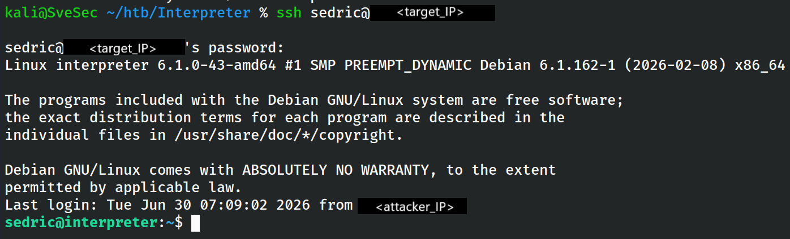

Authenticated access also provided the opportunity to inspect locally running services, application source code, and privilege escalation vectors that were not directly accessible from the initial foothold.

---

# Privilege Escalation

## Source Code Review

Following authenticated access, local enumeration focused on identifying custom applications, scheduled tasks, and services executed with elevated privileges.

During this process, a custom Python application (`notif.py`) was identified within the Mirth Connect environment.

Reviewing the application source code revealed an unsafe use of Python's `eval()` function for processing user-controlled input.

### Vulnerable Source Code

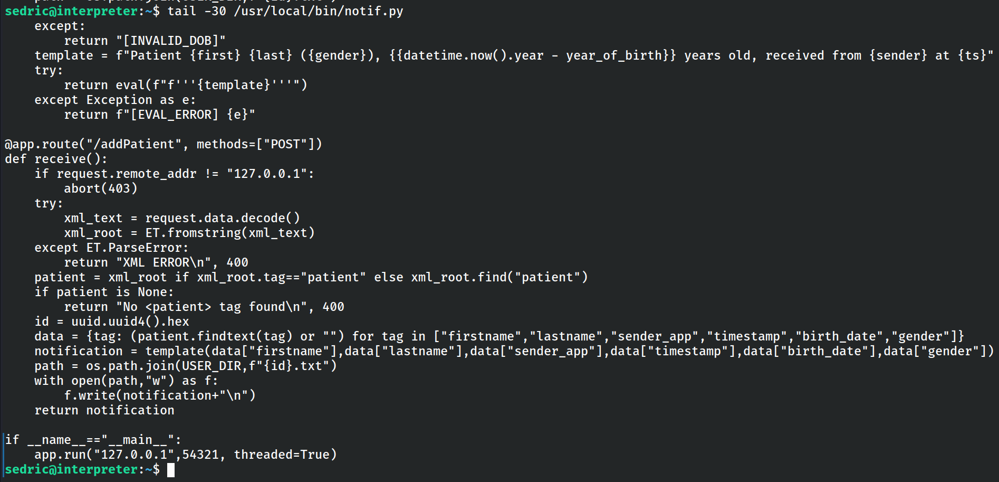

The application attempted to sanitize input using a regular expression before passing it directly to `eval()`. Although input validation was present, the implementation remained fundamentally insecure because attacker-controlled data was still evaluated as Python code.

This represented a classic case of insecure dynamic code execution.

---

## Vulnerability Validation

Before attempting privilege escalation, the identified vulnerability was validated using a harmless arithmetic payload.

Successful evaluation confirmed that attacker-controlled expressions were executed by the Python interpreter.

### SSTI / eval() Confirmation

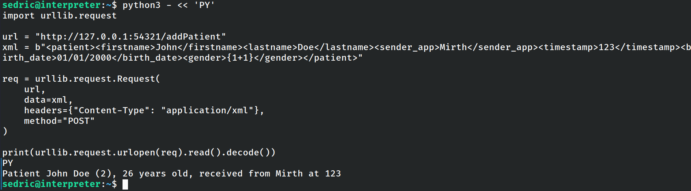

The successful execution confirmed that arbitrary Python expressions could be evaluated, demonstrating a reliable path toward privilege escalation.

---

## Root Code Execution

After validating the vulnerable code path, a controlled payload was constructed to execute operating system commands through the vulnerable `eval()` implementation.

Because the vulnerable application was executed with root privileges, successful exploitation resulted in arbitrary command execution as the root user.

### Root Code Execution

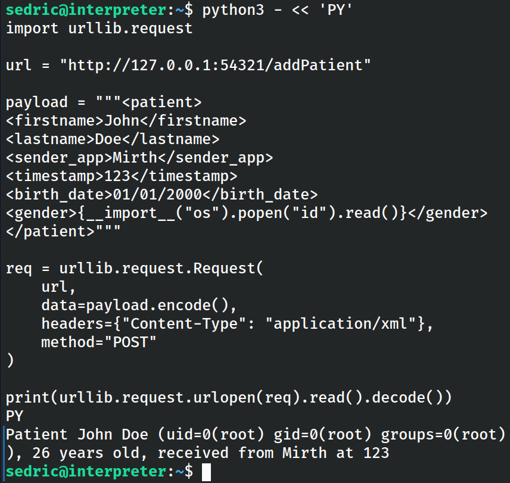

The assessment confirmed complete compromise of the operating system with unrestricted administrative privileges.

### Root Flag

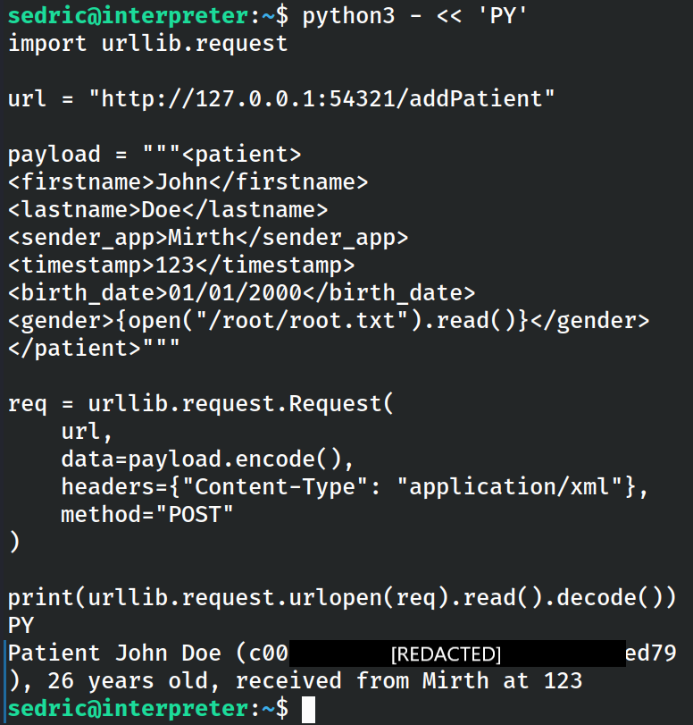

Following successful privilege escalation, access to the user flag was also verified as part of the assessment.

### User Flag

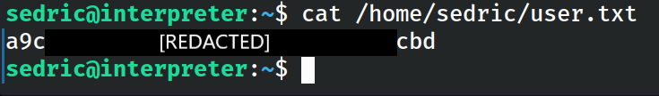

---

# Findings Summary

The assessment identified multiple security weaknesses which, when combined, resulted in full system compromise.

| ID | Finding | Severity | Status |
|----|----------|----------|--------|
| F-01 | CVE-2023-43208 Unauthenticated Remote Code Execution | Critical | Confirmed |
| F-02 | Plaintext Database Credentials Stored in Application Configuration | High | Confirmed |
| F-03 | Weak User Password Recoverable via Offline Cracking | High | Confirmed |
| F-04 | Unsafe Python `eval()` Leading to Root Code Execution | Critical | Confirmed |

The identified findings should not be viewed as isolated security issues. When combined, they created a complete attack chain that enabled an unauthenticated attacker to progress from external reconnaissance to full operating system compromise with root privileges.

---

# Risk Assessment

The overall security posture of the target system should be considered **Critical**.

Although the initial compromise relied on a publicly known vulnerability, several additional weaknesses significantly increased the impact of the attack.

The combination of vulnerable software, exposed application components, recoverable credentials, and unsafe Python code execution enabled an attacker to progress from unauthenticated access to complete operating system compromise.

No significant barriers prevented lateral progression between the identified attack stages once the initial foothold had been established.

From a business perspective, successful exploitation could result in complete loss of confidentiality, integrity, and availability of the affected system.

---

# Security Recommendations

The following remediation actions are recommended.

## Immediate Actions

1. Upgrade Mirth Connect to a non-vulnerable version.
2. Rotate all compromised credentials.
3. Remove embedded credentials from application configuration files.
4. Replace the unsafe Python `eval()` implementation with secure parsing logic.

## Long-Term Improvements

1. Enforce stronger password policies to resist offline password attacks.
2. Perform regular application dependency and vulnerability management.
3. Review application source code for unsafe dynamic execution patterns.
4. Implement defense-in-depth controls to reduce the impact of future application compromise.

---

# Conclusion

This assessment demonstrated a complete attack path from external reconnaissance to full operating system compromise.

The exploitation chain combined publicly known vulnerabilities, insecure credential management, weak password hygiene, and unsafe application design to achieve root-level code execution.

The assessment highlights the importance of secure software maintenance, credential protection, secure coding practices, and layered defensive controls in reducing the likelihood and impact of similar attacks.

This assessment demonstrates how multiple individually exploitable weaknesses can be chained together to achieve complete system compromise, emphasizing the importance of secure software development, credential management, and continuous vulnerability management.
